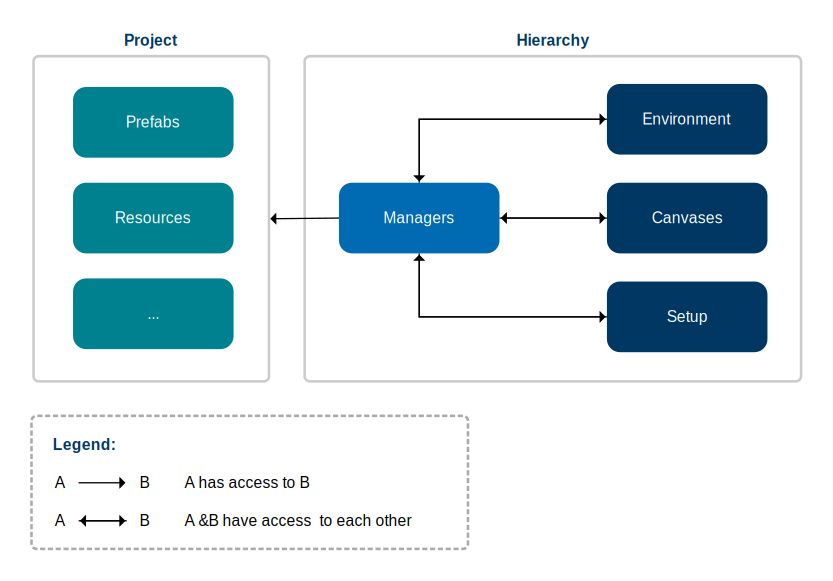
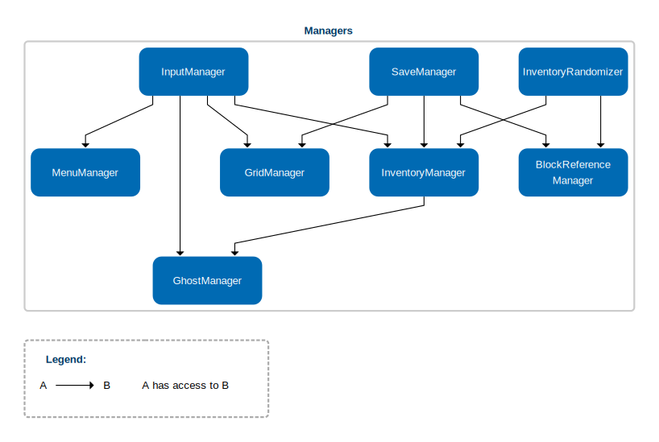
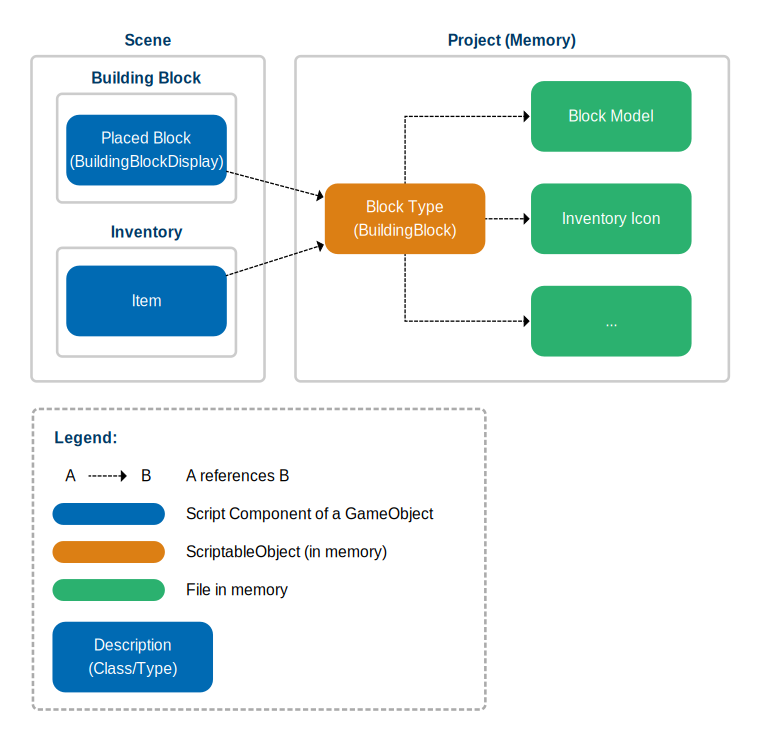

# Architecture
This project has some architecture guidelines to follow. They can be divided into [Hierarchy Architecture](#hierarchy) and [Project Architecture](#project).

The BuildingBlocks also follow an architecture which is described [here](#architecture).

##  Hierarchy Architecture
The hierarchy of the [Main Scene](/Brick-Building-Simulator/Assets/Scenes/BuildingScene.unity) follows these guidelines and is mainly inspired by [this video](https://youtu.be/tE1qH8OxO2Y?si=E4HgbW2wHT6wz7XR) from Tarodef and [this project](https://github.com/UnityTechnologies/open-project-1) from Unity Technologies.

The hierarchy is split into four major groups divided by each other with a Separator called `--------------`. Each group is a GameObject containing multiple other Child-GameObjects.

|Group|Function of child GameObjects|
|-|-|
|__Managers__|Controlling the logic of the Scene|
|__Setup__|GameObjects that do not fit into other Groups|
|__Environment__|Building Environment and all its blocks|
|__Canvases__|User-Interfaces|

The different groups interact like shown in this Image.

### Managers
There are multiple managers, each fulfilling one major task.

|Manager|Task|
|-|-|
|__BlockReferenceManager__|Stores BuildingBlock Scriptable Objects (Data Containers) so that storage does not have to be accessed directly. Manages access to the BuildingBlocks.|
|__GhostManager__|Controls the block ghost, a transparent block indicating the position a block will be placed.|
|__GridManager__|Instantiates and manages access to a Grid3D instance.|
|__InputManager__|Controls input and calls other managers.|
|__InventoryManager__|Instantiates and manages items as children of an Item Parent. Stores an item prefab so that memory does not have to be accessed directly.|
|__InventoryRandomizer__| Queries blocks from Block Reference Manager, Generates a distribution of blocks and Gives instructions for adding blocks to the InventoryManager|
|__MenuManager__|provides a wrapper for access to and from menus. He takes care of opening and closing panels within the software.|
|__SaveManager__|Manager that contains Methods for exporting and importing .json data|

The different managers interact like shown in this image.

##  Project Architecture
The project structure follows these guidelines and is mainly inspired by [this video](https://youtu.be/tE1qH8OxO2Y?si=E4HgbW2wHT6wz7XR) from Tarodef. Data is stored using a _structure by content type_ division.

The main folders are the following:

|Folder|Data Stored|
|-|-|
|___Scripts__|All the newly written code for this project. __Scripts_ is subdivided further into _Managers_, _Scriptables_, _Units_ and _Utilities_.|
|__Prefabs__|All Prefabs|
|__Resources__|Contains data relevant for BuildingBlocks and images for menus|
|__Scenes__|All Scenes|
|__Plugins__|Plugins and code from third parties|
|__Tests__|[Unity Test Framework](https://docs.unity3d.com/Packages/com.unity.test-framework@2.0/manual/index.html) EditMode and PlayMode tests|

##  BuildingBlocks
Building block types are generally defined in code by the BuildingBlock class. BuildingBlocks are ScriptableObjects. The BuildingBlockDisplay is only present in placed blocks. It references the block type it belongs to and contains other information such as position and rotation that is only relevant to placed blocks. Items represent building blocks that are inside the inventory.

The different Blocks reference each other like shown in this image.
